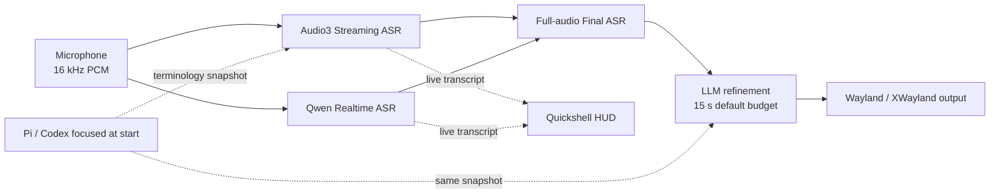

# Voice Input

> Low-latency, agent-aware voice dictation for Omarchy, Hyprland, and Wayland.

[](https://github.com/Saco93/voice-input/actions/workflows/ci.yml)
[](LICENSE)
[](https://www.rust-lang.org/)
[](https://wayland.freedesktop.org/)

**English** · [简体中文](README.zh-CN.md) · [Documentation](https://github.com/Saco93/voice-input/wiki) · [中文文档](https://github.com/Saco93/voice-input/wiki/Home.zh-CN)

Voice Input is a resident dictation service with realtime transcription, a native animated HUD, full-audio final recognition, conservative LLM cleanup, and optional terminology captured from the Pi or Codex session focused when dictation starts.

## How it works



1. A persistent PipeWire capture service keeps a short pre-roll buffer, so speech immediately after the hotkey is not lost. Sessions stop and finalize automatically at the configured duration limit (five minutes by default).
2. Qwen Realtime streams partial text to the HUD while Server VAD controls waveform visibility. Realtime delivery uses a bounded, nonblocking queue and fair bidirectional WebSocket processing. The worker may reconstruct the realtime session once after a pre-finish transport failure, an eight-second active-speech transcript stall, or sustained pitch-correlated local speech that receives no server event for eight seconds after text has appeared. Reconstruction replays every buffered raw PCM packet from the beginning while recording continues.
3. On toggle-off, the complete recording is optionally recognized again by the final ASR model. If the controlled reconstruction fails, its single retry is exhausted, or realtime delivery falls behind, incomplete remote text is rejected and the complete audio is recovered through the enabled final pass or local fallback.
4. If Pi or Codex is focused when dictation starts and session terminology is enabled, Voice Input locally redacts and segments the latest completed assistant message once, orders unique terms from least to most frequent in that source, and retains one immutable snapshot for the operation. Audio3 Streaming receives a newline-separated view of at most 400 characters in `run-task`; a reconnect replacement receives the identical view. Refine receives up to 96 terms and 1,500 term characters from the same snapshot. High-confidence technical variants that differ only in ASCII case or separators are normalized to the snapshot spelling before and after Refine. In Adaptive mode, a healthy completed Streaming result that actually sent Session Context is not replaced by Native recognition solely because the recording exceeded 30 seconds; all degradation recovery and the explicit Always mode remain unchanged. The transcript is lightly cleaned by an OpenAI-compatible LLM. The window focused at toggle-off still selects the refinement style: Pi and Codex receive compact Markdown that turns explicit sequences into ordered lists, unordered enumerations into bullet lists, and distinct parts into separate paragraphs; installed native messaging clients (WeChat, Feishu/Lark, Signal, and Telegram Desktop) receive conversational punctuation, preserve meaningful spoken particles, and omit a final full stop while retaining question marks, exclamation marks, and intentional ellipses; other destinations retain the lightly formal default. Refinement uses the configured timeout (15 seconds by default, capped at 30 seconds); when the budget is at least 10 seconds, contextual requests reserve five seconds for a transcript-only cleanup retry and ultimately fail open to Final ASR.
5. All text is delivered through clipboard paste with automatic restoration. Native Wayland delivery marks both the transient transcript and restored content as sensitive so compatible clipboard managers do not retain or reorder them. Wayland paste shortcuts use Hyprland's `sendshortcut` dispatcher, while XWayland uses `xdotool`; Voice Input never creates a `wtype` character keymap.

No-speech sessions return to idle once realtime or final ASR confirms that no transcript exists. Audio capture, ASR, HUD rendering, persistence, and output are isolated so a slow visual or clipboard client cannot block recognition.

## Quick setup

### Requirements

- Arch Linux / Omarchy with Hyprland and Wayland
- Rust toolchain, PipeWire (`pw-record`), and `wl-clipboard` 2.3 or newer (for sensitive clipboard hints)
- [Quickshell](https://quickshell.org/) for the HUD and Settings
- Qt Shader Tools 6.7 or newer (`qt6-shadertools` on Arch) to compile the HUD halo during installation; set `QSB=/path/to/qsb` for a nonstandard Qt installation
- Optional: `/usr/bin/voxtype` for local fallback; `xclip` + `xdotool` for XWayland

### Install

```bash
git clone https://github.com/Saco93/voice-input.git
cd voice-input
make enable-service
```

To update an existing source installation:

```bash
git pull --ff-only && make enable-service
```

This overwrites the installed binary, service definitions, and bundled desktop assets while preserving your user configuration and encrypted credentials. After an update, reopen Settings, reload Pi, and reload Hyprland. If you copied a Waybar snippet instead of referencing the installed snippet, merge the current snippet into your Waybar configuration again.

Then open Settings:

```bash
voice-input settings
```

Choose the ASR provider, add Alibaba/OpenRouter credentials, and enable LLM or agent context only when wanted. Credentials are encrypted through the standard per-user systemd credential store.

Add the generated Hyprland bindings:

```ini
source = ~/.local/share/voice-input/omarchy-hyprland-snippet.conf
```

The default controls are:

```text
F8                 Cancel the current dictation
F9                 Toggle dictation
F10                Discard and restart active dictation (ignored while idle)
Super+Ctrl+Alt+…   Move/reset the HUD
```

The corresponding recording commands are:

```bash
voice-input record toggle
voice-input record restart   # discard and restart; ignored while idle
voice-input record cancel
```

Verify the service:

```bash
voice-input status
systemctl --user status voice-input.service voice-input-hud.service
```

## Safe support diagnostics

Use `voice-input diagnostics [--format text|json]` as the canonical output for support reports. Schema 4 contains a safe summary of the current configuration and, when available, one active or most recently completed session. The session summary uses bounded stage statuses and failure categories; aggregate streaming delivery/result timings and counts (ready, partial, nonempty partial, segment-final, audio packets and sent duration, queue delays, finish, task completion/failure, and finalization); bounded Audio3 timestamp aggregates (timestamp-bearing results, accepted timed units, truncated units, results with rejected timestamp metadata, and the latest event-reported valid numeric audio-relative end in milliseconds); and the Audio3 native-pass mode/decision/reason. Each normal result contributes at most one rejected-timestamp-metadata count when its timestamp block contains any invalid scalar, relationship, words shape, or processed unit; truncation alone contributes zero. The latest valid end is overwritten by a later event that supplies one, with no cross-event monotonicity assumption. Timestamp diagnostics never include sentence IDs, timed-unit text or punctuation, transcripts, or provider messages. The safe summary reports the Audio3 endpoint mode and region, whether language hints and heartbeat are enabled, the effective maximum sentence silence and semantic-punctuation state after preset resolution, and the dynamic-vocabulary entry count. It never includes route identifiers, endpoint/host values, model, key, or vocabulary terms. A failed provider task may include an optional strictly bounded provider error identifier. That session summary remains available after completion and is reset when the next recording starts. It contains no audio, credentials, endpoints, model names, provider messages, window/application data, prompt context, tooltips, session history, or normal recognized/refined transcript text.

Do not paste `voice-input status` output into reports, with or without `--extended`. Status output is intended for local UI integration and can include the current or most recent transcript and tooltip text.

## Experimental Qwen-Audio-3

Qwen-Audio-3 is available as an explicit experimental provider. It is disabled by default and is not offered by the stable setup wizard. The explicit experimental gate and setup-wizard omission remain intentional while the beta is prepared. To try it, open Settings, choose **Qwen-Audio-3 (experimental)**, acknowledge the experimental-provider warning, and save. The existing encrypted Alibaba credential is shared with this provider. See the Wiki [Architecture](https://github.com/Saco93/voice-input/wiki/Architecture) and [Configuration](https://github.com/Saco93/voice-input/wiki/Configuration) pages for the detailed flow and option reference.

**Endpoint mode** defaults to **Regional**, with **Beijing** as the default region; **Singapore** is also selectable. Regional mode selects the fixed reviewed legacy Streaming and Native hosts for the chosen region. **Custom** mode uses the configured Streaming and Native URLs exactly, including path, port, and query bytes.

Migration is presence-aware. A configuration without `endpoint_mode` migrates to Regional Beijing only when both old URLs exactly equal the canonical Beijing pair, or to Regional Singapore only when both exactly equal the canonical Singapore pair. Mixed pairs, noncanonical hosts, loopback endpoints, proxies, and any custom path, port, or query migrate to Custom with both URL strings preserved byte-for-byte. An explicit endpoint mode takes precedence, and an explicit region takes precedence with Beijing as its missing-field default. Dormant raw URLs remain preserved.

Alibaba API keys are region-scoped. Changing the region may require replacing the encrypted Alibaba credential. Voice Input never probes another region and never migrates a key automatically. Singapore availability does not establish feature parity: each model, control combination, and language/vocabulary scenario still requires authorized live validation.

The streaming model supplies realtime text. When explicitly enabled and dictation starts in a validated Pi or Codex session, its `run-task` also receives at most 400 characters of locally redacted, low-frequency-first Session Context terminology; no `continue-task` event is used. On one recoverable transport interruption before `finish-task`, Voice Input creates a new Audio3 task, discards the old task's transcript, and replays retained PCM from the beginning at 4× realtime while recording continues. Retention is prefix-complete and limited by the configured recording duration, 300 seconds, and 10 MiB of PCM; exceeding the limit disables reconnect instead of retaining or replaying an incomplete prefix. A second interruption or a post-finish interruption uses the existing Native/local complete-audio recovery. **Language hints** and **streaming heartbeat** are independent opt-in settings and are disabled by default. Enabling language hints sends the existing language selection to Audio3: English uses `en`; Simplified and Traditional Chinese use `zh,en`; Japanese uses `ja,en`; and Korean uses `ko,en`. The extra English hint retains mixed-English recognition for Chinese, Japanese, and Korean; leaving the switch disabled preserves the provider's automatic detection. Enabling streaming heartbeat keeps long silent push-to-talk sessions alive while correctly formatted audio frames continue.

**Recognition preset** defaults to **Standard**, which preserves the existing `800` ms maximum sentence silence with semantic punctuation and multi-threshold mode disabled and no speech/noise threshold. **Low-latency dictation** uses `400` ms with multi-threshold mode enabled; **Long-form** uses `1300` ms with semantic punctuation enabled. Both mappings were accepted in an authorized, one-speaker evaluation and retained both clauses across a matrix with 250–2200 ms of inserted digital silence; acoustic speech boundaries remained dependent on local RMS trimming. The bounded sample does not establish a general accuracy or latency recommendation, so Standard remains the default. See [`docs/qwen-audio3-milestone2-evaluation.md`](docs/qwen-audio3-milestone2-evaluation.md). **Custom** exposes all raw controls; semantic punctuation and multi-threshold mode cannot be enabled together. Its optional speech/noise threshold must be finite and between `-1` and `1`; omission preserves provider behavior because Alibaba publishes no default. Settings displays every value that a custom request can send.

Optional **Dynamic vocabulary** entries are global to Audio3 and are sent to both streaming and native requests only when configured. Settings displays every remotely sent entry as one JSON object per line, for example `{"term":"Voice Input","weight":5}`. Terms use weights `1`–`5` or `50`; the local validator enforces the provider's term, duplicate, count, and weight limits. Dynamic terms are deliberately absent from routine support diagnostics.

**Native final pass** has three modes. **Streaming only** (the default) never sends the complete recording. **Adaptive** runs native recognition when realtime delivery is overloaded, a backend/event worker is interrupted, streaming is empty/failed/degraded, the server does not send an explicit `Finished` completion, or captured audio normally lasts at least 30 seconds. A usable, non-overloaded, explicitly finished stream skips Native when it is shorter than 30 seconds, and also when it actually sent Session Context even if it is longer; all degradation recovery conditions still apply. **Always** is the explicit maximum-accuracy choice and runs native recognition for every non-cancelled, nonempty recording. Existing configurations whose legacy boolean was `true` migrate to **Always**; `false` migrates to **Streaming only**.

When native recognition runs, it sends the complete recording to `qwen-audio-3.0-asr-flash`. A successful native transcript takes precedence. A native no-words result is authoritative when no usable streaming transcript exists; otherwise the usable streaming transcript is retained. If the native request fails or times out, usable streaming text remains available, followed by the configured local fallback only when needed. Cancellation never launches native recognition. Native requests accept at most 10 MiB of raw WAV audio.

Developers can test either API against a prerecorded 16 kHz mono PCM16 WAV without starting the daemon or delivering text to another application:

```bash
voice-input asr stream-test --file sample.wav  # WebSocket streaming
voice-input asr test --file sample.wav         # native full-audio request
```

Both commands require Qwen-Audio-3 to be selected and explicitly enabled in the active configuration. Remote tests send the supplied audio to the resolved Regional route or exact Custom endpoint and may incur API charges. Treat the provider, model names, endpoint compatibility, and transcript behavior as subject to change while this option remains experimental.

## Highlights

- Realtime Chinese/English mixed dictation with Server VAD
- Center-symmetric 62.5 FPS PCM waveform, independent of ASR packet cadence
- One controlled realtime reconstruction with complete buffered-audio replay, followed by complete-audio final recovery if needed
- Destination-aware LLM refinement, including structured Markdown for Pi/Codex and a shared conversational style for installed native messaging clients, with bounded latency and a transcript-only fallback
- Pi/Codex terminology context with validation, redaction, truncation, and prompt-injection isolation
- Clipboard-only text delivery with automatic restoration across Wayland/XWayland; native Wayland payloads use sensitive clipboard hints to stay out of compatible history managers, with no `wtype` character injection
- Encrypted systemd credentials; no secrets in config, argv, logs, or UI
- Theme-aware, monitor-aware, click-through Quickshell HUD with an integrated stage and effective recording timer
- Bundled Noto Sans SC variable UI font under the SIL Open Font License, with Qt's system-font fallback retained
- Native Quickshell Settings with validated Rust persistence and encrypted credentials
- Explicit `/usr/bin/voxtype` local fallback without binary-name ambiguity

## Documentation

| Topic | English | 简体中文 |
|---|---|---|
| Overview | [Wiki Home](https://github.com/Saco93/voice-input/wiki) | [中文首页](https://github.com/Saco93/voice-input/wiki/Home.zh-CN) |
| Architecture | [Architecture](https://github.com/Saco93/voice-input/wiki/Architecture) | [实现原理](https://github.com/Saco93/voice-input/wiki/Architecture.zh-CN) |
| Installation | [Installation](https://github.com/Saco93/voice-input/wiki/Installation) | [安装指南](https://github.com/Saco93/voice-input/wiki/Installation.zh-CN) |
| Configuration | [Configuration](https://github.com/Saco93/voice-input/wiki/Configuration) | [配置参考](https://github.com/Saco93/voice-input/wiki/Configuration.zh-CN) |
| Agent Context | [Agent Context](https://github.com/Saco93/voice-input/wiki/Agent-Context) | [Agent 上下文](https://github.com/Saco93/voice-input/wiki/Agent-Context.zh-CN) |
| Desktop Integration | [Desktop Integration](https://github.com/Saco93/voice-input/wiki/Desktop-Integration) | [桌面集成](https://github.com/Saco93/voice-input/wiki/Desktop-Integration.zh-CN) |
| Security and Privacy | [Security and Privacy](https://github.com/Saco93/voice-input/wiki/Security-and-Privacy) | [安全与隐私](https://github.com/Saco93/voice-input/wiki/Security-and-Privacy.zh-CN) |
| Troubleshooting | [Troubleshooting](https://github.com/Saco93/voice-input/wiki/Troubleshooting) | [故障排查](https://github.com/Saco93/voice-input/wiki/Troubleshooting.zh-CN) |
| Development | [Development](https://github.com/Saco93/voice-input/wiki/Development) | [开发指南](https://github.com/Saco93/voice-input/wiki/Development.zh-CN) |
| Contributing | [Contributing](CONTRIBUTING.md) | [贡献指南](CONTRIBUTING.zh-CN.md) |

## Privacy

Remote Qwen modes send audio to the selected Regional route or exact Custom Alibaba endpoint. LLM refinement sends the transcript and a coarse destination style through its system prompt (structured coding-agent Markdown, `instant-messaging`, or the default style) to the configured provider. When session terminology is explicitly enabled, Voice Input captures the Pi or Codex session focused at dictation start, redacts and caps its latest completed assistant message locally, segments it with Jieba, deduplicates terms, and orders them from least to most frequent. Audio3 Streaming and Refine receive separate bounded views of that same immutable snapshot; the source message, frequencies, window titles, process IDs, and raw desktop metadata are not included in either request. The public sample disables remote refinement and session terminology. Voice Input performs no telemetry or analytics collection.

## Project status

Voice Input is optimized for the author's Omarchy workflow but designed around replaceable ASR and OpenAI-compatible refinement adapters. Contributions and portability improvements are welcome.

This is an independent community project and is not affiliated with or endorsed by Omarchy, Alibaba, OpenAI, OpenRouter, Pi, Codex, or Voxtype.

## License

[MIT](LICENSE) © 2026 Saco Song
