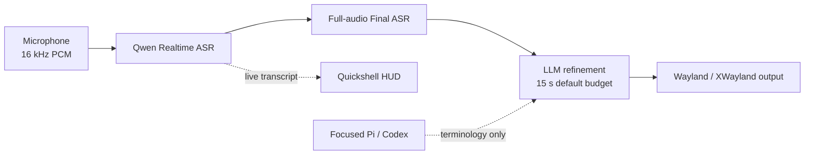

# Voice Input

> Low-latency, agent-aware voice dictation for Omarchy, Hyprland, and Wayland.

[](https://github.com/Saco93/voice-input/actions/workflows/ci.yml)
[](LICENSE)
[](https://www.rust-lang.org/)
[](https://wayland.freedesktop.org/)

**English** · [简体中文](README.zh-CN.md) · [Documentation](https://github.com/Saco93/voice-input/wiki) · [中文文档](https://github.com/Saco93/voice-input/wiki/Home.zh-CN)

Voice Input is a resident dictation service with realtime transcription, a native animated HUD, full-audio final recognition, conservative LLM cleanup, and optional terminology context from the focused Pi or Codex session.

## How it works



1. A persistent PipeWire capture service keeps a short pre-roll buffer, so speech immediately after the hotkey is not lost.
2. Qwen Realtime streams partial text to the HUD while Server VAD controls waveform visibility.
3. On toggle-off, the complete recording is optionally recognized again by the final ASR model.
4. The transcript is lightly cleaned by an OpenAI-compatible LLM. Refinement uses the configured timeout (15 seconds by default, capped at 30 seconds); when the budget is at least 10 seconds, contextual requests reserve five seconds for a transcript-only cleanup retry and ultimately fail open to Final ASR.
5. Short text is typed with `wtype`; long text and XWayland targets use clipboard paste with automatic restoration.

No-speech sessions cancel immediately. Audio capture, ASR, HUD rendering, persistence, and output are isolated so a slow visual or clipboard client cannot block recognition.

## Quick setup

### Requirements

- Arch Linux / Omarchy with Hyprland and Wayland
- Rust toolchain, PipeWire (`pw-record`), `wtype`, and `wl-clipboard`
- [Quickshell](https://quickshell.org/) for the HUD and Settings
- Qt Shader Tools (`qt6-shadertools` on Arch) to compile the HUD halo during installation; set `QSB=/path/to/qsb` for a nonstandard Qt installation
- Optional: `/usr/bin/voxtype` for local fallback; `xclip` + `xdotool` for XWayland

### Install

```bash
git clone https://github.com/Saco93/voice-input.git
cd voice-input
make enable-service
```

Then open Settings:

```bash
voice-input settings
```

Choose the ASR provider, add Alibaba/OpenRouter credentials, and enable LLM or agent context only when wanted. Credentials are encrypted through the standard per-user systemd credential store.

Add the generated Hyprland bindings:

```ini
source = ~/.local/share/voice-input/omarchy-hyprland-snippet.conf
```

The default controls are:

```text
F9                 Toggle dictation
Super+Ctrl+X       Toggle dictation
Super+Ctrl+Alt+…   Move/reset the HUD
```

Verify the service:

```bash
voice-input status
systemctl --user status voice-input.service voice-input-hud.service
```

## Highlights

- Realtime Chinese/English mixed dictation with Server VAD
- Center-symmetric 62.5 FPS PCM waveform, independent of ASR packet cadence
- Complete realtime transcript plus optional full-audio final pass
- Conservative LLM refinement with bounded latency and a transcript-only cleanup fallback
- Pi/Codex terminology context with validation, redaction, truncation, and prompt-injection isolation
- Automatic long-text paste and clipboard restoration across Wayland/XWayland
- Encrypted systemd credentials; no secrets in config, argv, logs, or UI
- Theme-aware, monitor-aware, click-through Quickshell HUD
- Native Quickshell Settings with validated Rust persistence and encrypted credentials
- Explicit `/usr/bin/voxtype` local fallback without binary-name ambiguity

## Documentation

| Topic | English | 简体中文 |
|---|---|---|
| Overview | [Wiki Home](https://github.com/Saco93/voice-input/wiki) | [中文首页](https://github.com/Saco93/voice-input/wiki/Home.zh-CN) |
| Architecture | [Architecture](https://github.com/Saco93/voice-input/wiki/Architecture) | [实现原理](https://github.com/Saco93/voice-input/wiki/Architecture.zh-CN) |
| Installation | [Installation](https://github.com/Saco93/voice-input/wiki/Installation) | [安装指南](https://github.com/Saco93/voice-input/wiki/Installation.zh-CN) |
| Configuration | [Configuration](https://github.com/Saco93/voice-input/wiki/Configuration) | [配置参考](https://github.com/Saco93/voice-input/wiki/Configuration.zh-CN) |
| Troubleshooting | [Troubleshooting](https://github.com/Saco93/voice-input/wiki/Troubleshooting) | [故障排查](https://github.com/Saco93/voice-input/wiki/Troubleshooting.zh-CN) |

The Wiki also covers agent context, desktop integration, privacy, and development.

## Privacy

Remote Qwen modes send audio to the configured Alibaba endpoint. LLM refinement sends the transcript—and, only when explicitly enabled, a capped and redacted agent-context excerpt—to the configured provider. The public sample disables remote refinement and agent context. Voice Input performs no telemetry or analytics collection.

## Project status

Voice Input is optimized for the author's Omarchy workflow but designed around replaceable ASR and OpenAI-compatible refinement adapters. Contributions and portability improvements are welcome.

This is an independent community project and is not affiliated with or endorsed by Omarchy, Alibaba, OpenAI, OpenRouter, Pi, Codex, or Voxtype.

## License

[MIT](LICENSE) © 2026 Saco Song
