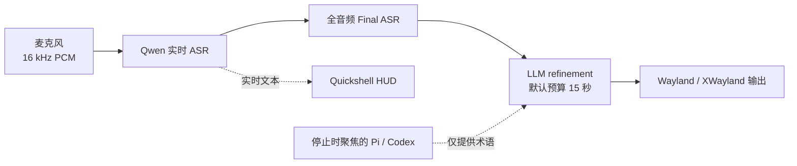

# Voice Input

> 面向 Omarchy、Hyprland 与 Wayland 的低延迟、Agent-aware 语音输入服务。

[](https://github.com/Saco93/voice-input/actions/workflows/ci.yml)
[](LICENSE)
[](https://www.rust-lang.org/)
[](https://wayland.freedesktop.org/)

[English](README.md) · **简体中文** · [Documentation](https://github.com/Saco93/voice-input/wiki) · [中文文档](https://github.com/Saco93/voice-input/wiki/Home.zh-CN)

Voice Input 是一个常驻式 dictation 服务，提供实时转写、原生动态 HUD、全音频最终识别、保守的 LLM 整理，以及来自 dictation 结束时聚焦的 Pi 或 Codex 会话的可选术语上下文。

## 实现原理



1. 常驻 PipeWire capture service 保留一小段 pre-roll，避免快捷键按下后最开始的语音被截掉。录音达到配置的时长上限后会自动停止并进入最终处理；默认上限为五分钟。
2. Qwen Realtime 持续把 partial transcript 发送到 HUD，Server VAD 控制波形是否可见。实时音频使用容量受限的非阻塞 queue，并公平处理双向 WebSocket 消息。如果结束录音前发生传输错误、Server VAD 确认语音段处于 active 状态但 transcript 停滞八秒，或者已经出现文本后检测到持续且具有音高相关性的本地语音，但连续八秒没有收到服务器事件，worker 可以重建一次实时会话。重建期间，worker 会从头重放所有已缓冲的原始 PCM packet，同时继续录音。
3. Toggle off 后，可选择让 Final ASR 对完整录音重新识别一次。如果受控重建失败、唯一一次重试已经用完，或者实时传输落后，程序会拒绝不完整的远程文本，并通过已启用的 final pass 或本地 fallback 对完整音频进行恢复识别。
4. OpenAI-compatible LLM 对文本做轻量整理。Toggle off 时聚焦的窗口决定 refinement 风格：Pi 和 Codex 使用紧凑的 Markdown，将明确的顺序转换为有序列表，将没有顺序的多项列举转换为无序列表，并将不同部分分成独立段落；系统中已安装的原生即时通讯客户端（WeChat、飞书/Lark、Signal 和 Telegram Desktop）使用自然的聊天标点，保留具有表达作用的口语语气词，并去掉消息末尾的句号，同时保留问号、感叹号和有意使用的省略号；其他窗口继续采用轻度书面化的默认风格。Refinement 使用配置的 timeout（默认 15 秒，最多 30 秒）；预算达到 10 秒时，包含 coding agent 上下文的请求会为纯 transcript 清理重试预留 5 秒，最终失败时使用 Final ASR。
5. 所有文本都通过剪贴板粘贴，并在结束后自动恢复原剪贴板。原生 Wayland 投递会把临时 transcript 和恢复的内容都标记为敏感，使兼容的剪贴板管理器不会保存或重新排序这些内容。Wayland 使用 Hyprland 的 `sendshortcut` dispatcher 发送粘贴快捷键，XWayland 使用 `xdotool`；Voice Input 不再创建 `wtype` 字符 keymap。

Realtime 或 Final ASR 确认没有 transcript 后，无语音 session 会直接回到 idle。音频采集、ASR、HUD、状态持久化和文本输出彼此隔离，缓慢的界面或剪贴板客户端不会阻塞识别。

## 快速安装

### 依赖

- 使用 Hyprland 与 Wayland 的 Arch Linux / Omarchy
- Rust toolchain、PipeWire（`pw-record`）和 `wl-clipboard` 2.3 或更高版本（用于敏感剪贴板标记）
- HUD 和 Settings 使用 [Quickshell](https://quickshell.org/)
- 安装时使用 Qt Shader Tools 6.7 或更高版本（Arch 软件包为 `qt6-shadertools`）编译 HUD 光晕；非标准 Qt 安装可通过 `QSB=/path/to/qsb` 指定工具
- 可选：本地 fallback 使用 `/usr/bin/voxtype`；XWayland 使用 `xclip` + `xdotool`

### 安装

```bash
git clone https://github.com/Saco93/voice-input.git
cd voice-input
make enable-service
```

打开设置：

```bash
voice-input settings
```

选择 ASR provider，填写 Alibaba/OpenRouter 凭据，并按需启用 LLM 或 Agent context。凭据通过标准的 systemd 用户 credential store 加密保存。

加载 Hyprland 快捷键：

```ini
source = ~/.local/share/voice-input/omarchy-hyprland-snippet.conf
```

默认控制：

```text
F8                 取消当前 dictation
F9                 开始/结束 dictation
F10                丢弃并重新开始正在录制的 dictation（idle 时忽略）
Super+Ctrl+Alt+…   移动或重置 HUD
```

检查服务：

```bash
voice-input status
systemctl --user status voice-input.service voice-input-hud.service
```

## 安全的支持诊断信息

提交支持报告时，请使用 `voice-input diagnostics [--format text|json]` 作为标准诊断输出。Schema 4 只提供当前 session 或最近完成的 session，并使用固定字段记录各阶段状态和失败类别、流式投递与结果的汇总耗时和计数（ready、partial、非空 partial、segment-final、音频包及已发送音频时长、队列延迟、finish、任务完成或失败以及 finalization）、有明确数量上限的 Audio3 时间戳汇总数据（包含时间戳的结果数、接受的计时单元数、因超过上限而截断的单元数、时间戳元数据被拒绝的结果数，以及最近一个事件报告的有效音频相对结束毫秒数）、Audio3 原生最终处理的模式/决定/原因，以及安全的配置摘要。如果一个普通结果的时间戳块包含任何无效标量、关系、`words` 结构或已处理单元，该结果最多使“时间戳元数据被拒绝的结果数”增加 1；仅发生截断时不会增加该计数。如果后续事件提供有效结束时间，诊断信息会直接覆盖此前的值，不假设不同事件之间单调递增。时间戳诊断信息不会包含句子 ID、计时单元文本或标点、transcript 或提供商消息。安全摘要说明 Audio3 的端点模式和区域、是否配置了工作空间 ID、语言提示和 heartbeat 是否启用、解析预设后生效的最大句末静音时长和语义标点状态，以及动态词汇表的词条数量。它不会包含工作空间 ID、端点或主机、模型、key 或词条内容。提供商任务失败时，诊断信息可能包含一个可选且长度和字符范围受到严格限制的提供商错误标识符。完成后的摘要会保留到下一次录音开始，并在新录音开始时重置。输出不包含音频、凭据、端点、模型名称、提供商消息、窗口或应用信息、prompt context、tooltip、session 历史记录，也不包含正常的识别或整理后 transcript 文本。

请勿把 `voice-input status` 的输出粘贴到报告中，无论是否使用 `--extended`。状态输出用于本地 UI 集成，可能包含当前或最近一次 transcript 和 tooltip 文本。

## 实验性 Qwen-Audio-3

Qwen-Audio-3 目前作为需要明确启用的实验性提供商使用。该选项默认关闭，稳定安装向导也不会提供它。在 beta 准备期间，明确的实验功能开关以及安装向导不提供该选项都是有意保留的设计。如需试用，请打开 Settings，选择 **Qwen-Audio-3（实验性）**，确认实验功能警告后保存。该提供商与现有 Alibaba 实时识别共用同一份加密凭据。

**端点模式**默认使用**区域路由**，默认区域为**北京**，也可以选择**新加坡**。在区域路由模式下，**工作空间 ID** 留空时会使用所选区域经过审核的 Alibaba 旧版主机；填写该值后，流式请求和原生请求都会通过该工作空间对应且经过审核的区域主机名发送。程序把工作空间 ID 视为不透明的提供商值。因为该值会占用一个主机名 label，Voice Input 只验证传输约束：必须包含 1–63 个 ASCII 字母、数字或连字符，且首尾不能是连字符。这项检查不代表 Alibaba 的业务 ID 规则。Voice Input 不会添加工作空间 header、query 字段或请求正文（request body）字段。**自定义**模式会原样使用已配置的流式 URL 和原生 URL，并忽略处于非活动状态的工作空间 ID。

迁移过程会区分字段是否存在。未包含 `endpoint_mode` 的配置只有在两个旧 URL 与北京标准组合完全相同时，才会迁移到北京区域路由；只有在两个 URL 与新加坡标准组合完全相同时，才会迁移到新加坡区域路由。两种迁移都会原样保留明确配置的工作空间 ID；该字段缺失或为空时仍保持为空。混合组合、当前工作空间主机、回环端点、代理，以及带有自定义路径、端口或 query 的配置都会迁移到自定义模式，并逐字节保留两个 URL 字符串；Voice Input 绝不会根据主机推断工作空间 ID。明确配置的端点模式具有优先级；明确配置的区域也具有优先级，缺少区域字段时默认使用北京。程序还会保留处于非活动状态的原始 URL。

Alibaba API key 受区域和工作空间范围约束。更改其中任何一项后，用户可能需要替换同一份加密 Alibaba 凭据。Voice Input 绝不会探测其他区域或工作空间，也不会自动迁移 key。本阶段有意不增加按区域分别保存的凭据。支持选择新加坡区域并不表示已经实现完整功能一致性；每个模型、控制项组合、语言或词汇表场景以及工作空间路由仍需完成经过授权的在线验证。

流式模型负责提供实时文本。**语言提示**和**流式 heartbeat** 是两个相互独立的选用设置，默认均为关闭。启用语言提示后，程序会把现有语言选项发送给 Audio3：英语使用 `en`；简体中文和繁体中文使用 `zh,en`；日语使用 `ja,en`；韩语使用 `ko,en`。中文、日语和韩语的额外英语提示用于保留英语混合识别；关闭该开关会保留服务商的自动检测行为。启用流式 heartbeat 后，只要程序继续发送格式正确的音频帧，它就能使长时间静音的按键说话 session 保持连接。

**识别预设**默认使用**标准**。该预设保留现有行为：最大句末静音时长为 `800` 毫秒，语义标点和多阈值模式均关闭，并且不发送语音/噪声阈值。**低延迟听写**使用 `400` 毫秒并启用多阈值模式；**长篇语音**使用 `1300` 毫秒并启用语义标点。经过授权的单说话人评估确认服务端接受这两个映射；在插入了 250–2200 毫秒数字静音的测试矩阵中，两者都保留了静音前后的内容。声学语音边界仍取决于本地 RMS 裁剪。有限样本无法形成通用的准确率或延迟建议，因此标准预设仍为默认值。详见 [`docs/qwen-audio3-milestone2-evaluation.md`](docs/qwen-audio3-milestone2-evaluation.md)。**自定义**会显示全部原始控制项；语义标点与多阈值模式不能同时启用。可选的语音/噪声阈值必须是 `-1` 到 `1` 之间的有限数值；Alibaba 未公布默认值，因此省略该字段可以保留服务商行为。Settings 会显示自定义请求可能发送的每一个值。

用户可以配置可选的全局**动态词汇表**。程序只在配置不为空时，才会把词条发送给 Audio3 的流式请求和原生请求。Settings 会用每行一个 JSON 对象的方式显示所有将发送到远程服务的词条，例如 `{"term":"Voice Input","weight":5}`。权重可以是 `1`–`5` 或 `50`；本地验证会检查服务商规定的词条、重复项、数量和权重限制。常规支持诊断信息不会包含动态词条。

**原生最终处理**提供三种模式。默认的**仅流式识别**不会发送完整录音。**自适应**模式会在实时音频传输过载、后端或事件 worker 中断、流式识别为空/失败/降级、服务端未发送明确的 `Finished` 完成事件，或者录音达到 30 秒时运行原生识别。只有可用、未过载、明确完成且短于 30 秒的流式识别才会跳过原生识别。**始终运行**是明确请求最高准确度的选项，会对每段未取消且非空的录音运行原生识别。旧配置中的 boolean 为 `true` 时会迁移到**始终运行**，为 `false` 时会迁移到**仅流式识别**。

运行原生识别时，程序会把完整录音发送给 `qwen-audio-3.0-asr-flash`。成功的原生 transcript 优先级最高。如果原生服务返回无词结果，并且没有可用的流式 transcript，该结果具有最终效力；如果已有可用的流式 transcript，程序会保留它。原生请求失败或超时时，程序会保留可用的流式文本；仍无可用文本时，才会使用已配置的本地备用识别。取消操作不会启动原生识别。原生请求最多接受 10 MiB 的原始 WAV 音频。

开发者可以使用预先录制的 16 kHz、单声道、PCM16 WAV 分别测试两个 API。以下命令不会启动守护进程，也不会把识别文本输入其他应用：

```bash
voice-input asr stream-test --file sample.wav  # WebSocket 流式识别
voice-input asr test --file sample.wav         # 原生完整音频识别
```

两个命令都要求当前配置已经选择并明确启用 Qwen-Audio-3。远程测试会把指定音频发送到解析后的区域路由或完全按原值使用的自定义 Alibaba 端点，并且可能产生 API 费用。在该选项仍处于实验阶段时，提供商行为、模型名称、端点兼容性和识别结果都可能发生变化。

## 主要能力

- 支持中英文混合输入的 Qwen Realtime + Server VAD
- 与 ASR packet cadence 解耦的 62.5 FPS 中心对称 PCM 波形
- 一次受控的实时会话重建与完整缓冲音频重放；重建失败后使用完整音频进行最终恢复
- 根据目标窗口选择风格的 LLM refinement，包括 Pi/Codex 的结构化 Markdown 和所有已安装原生即时通讯客户端共用的口语化整理，并保留延迟限制和纯 transcript fallback
- Pi/Codex 术语上下文：进程验证、脱敏、截断与 prompt-injection 隔离
- Wayland/XWayland 统一使用剪贴板输入并自动恢复原内容；原生 Wayland payload 使用敏感剪贴板标记，避免进入兼容的历史记录管理器；不再通过 `wtype` 注入字符
- systemd 加密凭据：配置、argv、日志和 UI 中不保存密钥
- 跟随 Omarchy 主题、焦点显示器且不抢焦点的 Quickshell HUD，并在内部显示阶段和有效录音计时
- 内置采用 SIL Open Font License 的 Noto Sans SC 可变 UI 字体，同时保留 Qt 的系统字体 fallback
- 原生 Quickshell Settings，由 Rust 负责配置验证、持久化和加密凭据
- 明确使用 `/usr/bin/voxtype` 作为本地 fallback，不再与主程序同名混淆

## 文档

| 主题 | English | 简体中文 |
|---|---|---|
| 项目概览 | [Wiki Home](https://github.com/Saco93/voice-input/wiki) | [中文首页](https://github.com/Saco93/voice-input/wiki/Home.zh-CN) |
| 实现原理 | [Architecture](https://github.com/Saco93/voice-input/wiki/Architecture) | [实现原理](https://github.com/Saco93/voice-input/wiki/Architecture.zh-CN) |
| 安装 | [Installation](https://github.com/Saco93/voice-input/wiki/Installation) | [安装指南](https://github.com/Saco93/voice-input/wiki/Installation.zh-CN) |
| 配置 | [Configuration](https://github.com/Saco93/voice-input/wiki/Configuration) | [配置参考](https://github.com/Saco93/voice-input/wiki/Configuration.zh-CN) |
| 故障排查 | [Troubleshooting](https://github.com/Saco93/voice-input/wiki/Troubleshooting) | [故障排查](https://github.com/Saco93/voice-input/wiki/Troubleshooting.zh-CN) |
| 开发与贡献 | [Contributing](CONTRIBUTING.md) | [贡献指南](CONTRIBUTING.zh-CN.md) |

Wiki 还包含 Agent context、桌面集成、安全隐私和开发说明。

## 隐私

远程 Qwen 模式会把音频发送到所选的区域路由或完全按原值使用的自定义 Alibaba 端点。LLM refinement 会把 transcript 和粗粒度的目标风格（coding agent 结构化 Markdown、`instant-messaging` 或默认风格）通过 system prompt 发送到配置的 provider；只有在用户明确启用 Agent context 时，才会额外发送经过截断与脱敏的会话片段。LLM 请求不会包含窗口标题、进程 ID 或原始桌面元数据。公开示例配置默认关闭远程 refinement 和 Agent context。Voice Input 不收集遥测或分析数据。

## 项目状态

Voice Input 针对作者的 Omarchy 工作流进行了优化，但 ASR 与 OpenAI-compatible refinement 都采用可替换 adapter。欢迎贡献和改进跨发行版兼容性。

这是一个独立社区项目，与 Omarchy、Alibaba、OpenAI、OpenRouter、Pi、Codex 或 Voxtype 没有官方隶属或背书关系。

## License

[MIT](LICENSE) © 2026 Saco Song
