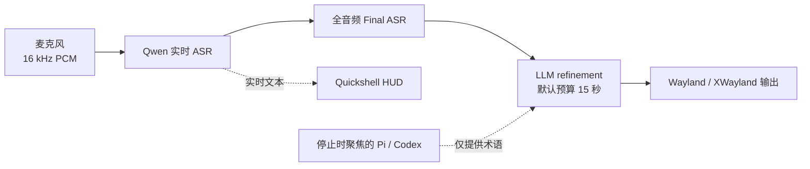

# Voice Input

> 面向 Omarchy、Hyprland 与 Wayland 的低延迟、Agent-aware 语音输入服务。

[](https://github.com/Saco93/voice-input/actions/workflows/ci.yml)
[](LICENSE)
[](https://www.rust-lang.org/)
[](https://wayland.freedesktop.org/)

[English](README.md) · **简体中文** · [Documentation](https://github.com/Saco93/voice-input/wiki) · [中文文档](https://github.com/Saco93/voice-input/wiki/Home.zh-CN)

Voice Input 是一个常驻式 dictation 服务，提供实时转写、原生动态 HUD、全音频最终识别、保守的 LLM 整理，以及来自 dictation 结束时聚焦的 Pi 或 Codex 会话的可选术语上下文。

## 实现原理



1. 常驻 PipeWire capture service 保留一小段 pre-roll，避免快捷键按下后最开始的语音被截掉。录音达到配置的时长上限后会自动停止并进入最终处理；默认上限为五分钟。
2. Qwen Realtime 持续把 partial transcript 发送到 HUD，Server VAD 控制波形是否可见。实时音频使用容量受限的非阻塞 queue，并公平处理双向 WebSocket 消息。如果结束录音前发生传输错误、Server VAD 确认语音段处于 active 状态但 transcript 停滞八秒，或者已经出现文本后检测到持续且具有音高相关性的本地语音，但连续八秒没有收到服务器事件，worker 可以重建一次实时会话。重建期间，worker 会从头重放所有已缓冲的原始 PCM packet，同时继续录音。
3. Toggle off 后，可选择让 Final ASR 对完整录音重新识别一次。如果受控重建失败、唯一一次重试已经用完，或者实时传输落后，程序会拒绝不完整的远程文本，并通过已启用的 final pass 或本地 fallback 对完整音频进行恢复识别。
4. OpenAI-compatible LLM 对文本做轻量整理。Toggle off 时聚焦的窗口决定 refinement 风格：Pi 和 Codex 使用紧凑的 Markdown，将明确的顺序转换为有序列表，将没有顺序的多项列举转换为无序列表，并将不同部分分成独立段落；系统中已安装的原生即时通讯客户端（WeChat、飞书/Lark、Signal 和 Telegram Desktop）使用自然的聊天标点，保留具有表达作用的口语语气词，并去掉消息末尾的句号，同时保留问号、感叹号和有意使用的省略号；其他窗口继续采用轻度书面化的默认风格。Refinement 使用配置的 timeout（默认 15 秒，最多 30 秒）；预算达到 10 秒时，包含 coding agent 上下文的请求会为纯 transcript 清理重试预留 5 秒，最终失败时使用 Final ASR。
5. 所有文本都通过剪贴板粘贴，并在结束后自动恢复原剪贴板。Wayland 使用 Hyprland 的 `sendshortcut` dispatcher 发送粘贴快捷键，XWayland 使用 `xdotool`；Voice Input 不再创建 `wtype` 字符 keymap。

Realtime 或 Final ASR 确认没有 transcript 后，无语音 session 会直接回到 idle。音频采集、ASR、HUD、状态持久化和文本输出彼此隔离，缓慢的界面或剪贴板客户端不会阻塞识别。

## 快速安装

### 依赖

- 使用 Hyprland 与 Wayland 的 Arch Linux / Omarchy
- Rust toolchain、PipeWire（`pw-record`）和 `wl-clipboard`
- HUD 和 Settings 使用 [Quickshell](https://quickshell.org/)
- 安装时使用 Qt Shader Tools 6.7 或更高版本（Arch 软件包为 `qt6-shadertools`）编译 HUD 光晕；非标准 Qt 安装可通过 `QSB=/path/to/qsb` 指定工具
- 可选：本地 fallback 使用 `/usr/bin/voxtype`；XWayland 使用 `xclip` + `xdotool`

### 安装

```bash
git clone https://github.com/Saco93/voice-input.git
cd voice-input
make enable-service
```

打开设置：

```bash
voice-input settings
```

选择 ASR provider，填写 Alibaba/OpenRouter 凭据，并按需启用 LLM 或 Agent context。凭据通过标准的 systemd 用户 credential store 加密保存。

加载 Hyprland 快捷键：

```ini
source = ~/.local/share/voice-input/omarchy-hyprland-snippet.conf
```

默认控制：

```text
F8                 取消当前 dictation
F9                 开始/结束 dictation
F10                丢弃并重新开始正在录制的 dictation（idle 时忽略）
Super+Ctrl+Alt+…   移动或重置 HUD
```

检查服务：

```bash
voice-input status
systemctl --user status voice-input.service voice-input-hud.service
```

## 实验性 Qwen-Audio-3

Qwen-Audio-3 目前作为需要明确启用的实验性提供商使用。该选项默认关闭，稳定安装向导也不会提供它。如需试用，请打开 Settings，选择 **Qwen-Audio-3（实验性）**，确认实验功能警告后保存。该提供商与现有 Alibaba 实时识别共用同一份加密凭据。

流式模型负责提供实时文本。用户还可以启用**原生最终处理**：录音停止后，程序会把完整录音发送给 `qwen-audio-3.0-asr-flash`，成功时使用它的结果替换流式结果。如果原生请求失败，程序仍可使用已有的实时文本或配置的本地备用识别。

开发者可以使用预先录制的 16 kHz、单声道、PCM16 WAV 分别测试两个 API。以下命令不会启动守护进程，也不会把识别文本输入其他应用：

```bash
voice-input asr stream-test --file sample.wav  # WebSocket 流式识别
voice-input asr test --file sample.wav         # 原生完整音频识别
```

两个命令都要求当前配置已经选择并明确启用 Qwen-Audio-3。远程测试会把指定音频发送到配置的 Alibaba endpoint，并且可能产生 API 费用。在该选项仍处于实验阶段时，提供商行为、模型名称、端点兼容性和识别结果都可能发生变化。

## 主要能力

- 支持中英文混合输入的 Qwen Realtime + Server VAD
- 与 ASR packet cadence 解耦的 62.5 FPS 中心对称 PCM 波形
- 一次受控的实时会话重建与完整缓冲音频重放；重建失败后使用完整音频进行最终恢复
- 根据目标窗口选择风格的 LLM refinement，包括 Pi/Codex 的结构化 Markdown 和所有已安装原生即时通讯客户端共用的口语化整理，并保留延迟限制和纯 transcript fallback
- Pi/Codex 术语上下文：进程验证、脱敏、截断与 prompt-injection 隔离
- Wayland/XWayland 统一使用剪贴板输入并自动恢复原内容，不再通过 `wtype` 注入字符
- systemd 加密凭据：配置、argv、日志和 UI 中不保存密钥
- 跟随 Omarchy 主题、焦点显示器且不抢焦点的 Quickshell HUD，并在内部显示阶段和有效录音计时
- 内置采用 SIL Open Font License 的 Noto Sans SC 可变 UI 字体，同时保留 Qt 的系统字体 fallback
- 原生 Quickshell Settings，由 Rust 负责配置验证、持久化和加密凭据
- 明确使用 `/usr/bin/voxtype` 作为本地 fallback，不再与主程序同名混淆

## 文档

| 主题 | English | 简体中文 |
|---|---|---|
| 项目概览 | [Wiki Home](https://github.com/Saco93/voice-input/wiki) | [中文首页](https://github.com/Saco93/voice-input/wiki/Home.zh-CN) |
| 实现原理 | [Architecture](https://github.com/Saco93/voice-input/wiki/Architecture) | [实现原理](https://github.com/Saco93/voice-input/wiki/Architecture.zh-CN) |
| 安装 | [Installation](https://github.com/Saco93/voice-input/wiki/Installation) | [安装指南](https://github.com/Saco93/voice-input/wiki/Installation.zh-CN) |
| 配置 | [Configuration](https://github.com/Saco93/voice-input/wiki/Configuration) | [配置参考](https://github.com/Saco93/voice-input/wiki/Configuration.zh-CN) |
| 故障排查 | [Troubleshooting](https://github.com/Saco93/voice-input/wiki/Troubleshooting) | [故障排查](https://github.com/Saco93/voice-input/wiki/Troubleshooting.zh-CN) |
| 开发与贡献 | [Contributing](CONTRIBUTING.md) | [贡献指南](CONTRIBUTING.zh-CN.md) |

Wiki 还包含 Agent context、桌面集成、安全隐私和开发说明。

## 隐私

远程 Qwen 模式会把音频发送到配置的 Alibaba endpoint。LLM refinement 会把 transcript 和粗粒度的目标风格（coding agent 结构化 Markdown、`instant-messaging` 或默认风格）通过 system prompt 发送到配置的 provider；只有在用户明确启用 Agent context 时，才会额外发送经过截断与脱敏的会话片段。LLM 请求不会包含窗口标题、进程 ID 或原始桌面元数据。公开示例配置默认关闭远程 refinement 和 Agent context。Voice Input 不收集遥测或分析数据。

## 项目状态

Voice Input 针对作者的 Omarchy 工作流进行了优化，但 ASR 与 OpenAI-compatible refinement 都采用可替换 adapter。欢迎贡献和改进跨发行版兼容性。

这是一个独立社区项目，与 Omarchy、Alibaba、OpenAI、OpenRouter、Pi、Codex 或 Voxtype 没有官方隶属或背书关系。

## License

[MIT](LICENSE) © 2026 Saco Song
