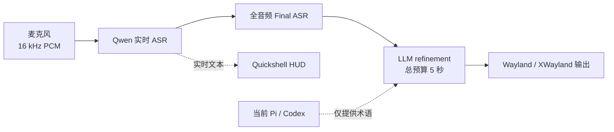

# Voice Input

> 面向 Omarchy、Hyprland 与 Wayland 的低延迟、Agent-aware 语音输入服务。

[](https://github.com/Saco93/voice-input/actions/workflows/ci.yml)
[](LICENSE)
[](https://www.rust-lang.org/)
[](https://wayland.freedesktop.org/)

[English](README.md) · **简体中文** · [Documentation](https://github.com/Saco93/voice-input/wiki) · [中文文档](https://github.com/Saco93/voice-input/wiki/Home.zh-CN)

Voice Input 是一个常驻式 dictation 服务，提供实时转写、原生动态 HUD、全音频最终识别、保守的 LLM 整理，以及来自当前 Pi 或 Codex 会话的可选术语上下文。

## 实现原理



1. 常驻 PipeWire capture service 保留一小段 pre-roll，避免快捷键按下后最开始的语音被截掉。
2. Qwen Realtime 持续把 partial transcript 发送到 HUD，Server VAD 控制波形是否可见。
3. Toggle off 后，可选择让 Final ASR 对完整录音重新识别一次。
4. OpenAI-compatible LLM 对文本做轻量整理。整个 refinement 共用五秒预算，失败时直接使用 Final ASR。
5. 短文本通过 `wtype` 输入；长文本和 XWayland 窗口自动使用剪贴板粘贴，并在结束后恢复原剪贴板。

没有检测到语音时会立即取消。音频采集、ASR、HUD、状态持久化和文本输出彼此隔离，缓慢的界面或剪贴板客户端不会阻塞识别。

## 快速安装

### 依赖

- 使用 Hyprland 与 Wayland 的 Arch Linux / Omarchy
- Rust toolchain、PipeWire（`pw-record`）、`wtype`、`wl-clipboard`
- HUD 和 Settings 使用 [Quickshell](https://quickshell.org/)
- 可选：本地 fallback 使用 `/usr/bin/voxtype`；XWayland 使用 `xclip` + `xdotool`

### 安装

```bash
git clone https://github.com/Saco93/voice-input.git
cd voice-input
make enable-service
```

打开设置：

```bash
voice-input settings
```

选择 ASR provider，填写 Alibaba/OpenRouter 凭据，并按需启用 LLM 或 Agent context。凭据通过标准的 systemd 用户 credential store 加密保存。

加载 Hyprland 快捷键：

```ini
source = ~/.local/share/voice-input/omarchy-hyprland-snippet.conf
```

默认控制：

```text
F9                 开始/结束 dictation
Super+Ctrl+X       开始/结束 dictation
Super+Ctrl+Alt+…   移动或重置 HUD
```

检查服务：

```bash
voice-input status
systemctl --user status voice-input.service voice-input-hud.service
```

## 主要能力

- 支持中英文混合输入的 Qwen Realtime + Server VAD
- 与 ASR packet cadence 解耦的 62.5 FPS 中心对称 PCM 波形
- 完整 Realtime transcript 与可选的全音频 Final ASR
- 共享严格延迟预算的保守 LLM refinement
- Pi/Codex 术语上下文：进程验证、脱敏、截断与 prompt-injection 隔离
- Wayland/XWayland 长文本自动粘贴与剪贴板恢复
- systemd 加密凭据：配置、argv、日志和 UI 中不保存密钥
- 跟随 Omarchy 主题、焦点显示器且不抢焦点的 Quickshell HUD
- 原生 Quickshell Settings，由 Rust 负责配置验证、持久化和加密凭据
- 明确使用 `/usr/bin/voxtype` 作为本地 fallback，不再与主程序同名混淆

## 文档

| 主题 | English | 简体中文 |
|---|---|---|
| 项目概览 | [Wiki Home](https://github.com/Saco93/voice-input/wiki) | [中文首页](https://github.com/Saco93/voice-input/wiki/Home.zh-CN) |
| 实现原理 | [Architecture](https://github.com/Saco93/voice-input/wiki/Architecture) | [实现原理](https://github.com/Saco93/voice-input/wiki/Architecture.zh-CN) |
| 安装 | [Installation](https://github.com/Saco93/voice-input/wiki/Installation) | [安装指南](https://github.com/Saco93/voice-input/wiki/Installation.zh-CN) |
| 配置 | [Configuration](https://github.com/Saco93/voice-input/wiki/Configuration) | [配置参考](https://github.com/Saco93/voice-input/wiki/Configuration.zh-CN) |
| 故障排查 | [Troubleshooting](https://github.com/Saco93/voice-input/wiki/Troubleshooting) | [故障排查](https://github.com/Saco93/voice-input/wiki/Troubleshooting.zh-CN) |

Wiki 还包含 Agent context、桌面集成、安全隐私和开发说明。

## 隐私

远程 Qwen 模式会把音频发送到配置的 Alibaba endpoint。LLM refinement 会把 transcript 发送到配置的 provider；只有在用户明确启用时，才会附带经过截断与脱敏的 Agent context。公开示例配置默认关闭远程 refinement 和 Agent context。Voice Input 不收集遥测或分析数据。

## 项目状态

Voice Input 针对作者的 Omarchy 工作流进行了优化，但 ASR 与 OpenAI-compatible refinement 都采用可替换 adapter。欢迎贡献和改进跨发行版兼容性。

这是一个独立社区项目，与 Omarchy、Alibaba、OpenAI、OpenRouter、Pi、Codex 或 Voxtype 没有官方隶属或背书关系。

## License

[MIT](LICENSE) © 2026 Saco Song
